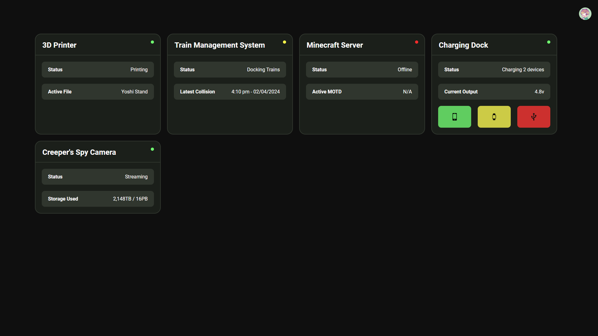
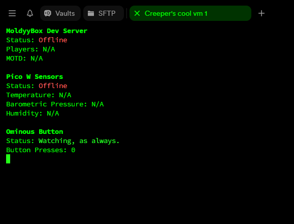

# Adruino Dashboard

It's a dashboard! It shows live statistics from my to-be projects, and in the future the dashboard will be able to control them (with magical mind powers).

Currently it runs on a server in london with a website to view the [dashboard](https://arduino.declan-reid.me/Dashboard/), a socket server for the hosts (my arduinos and things) to interface with the server on, and a websocket server for the dashboard to interface with the socket server (because browsers are evil).

and uhhh, have fun I guess lol. It's not secure yet 👀